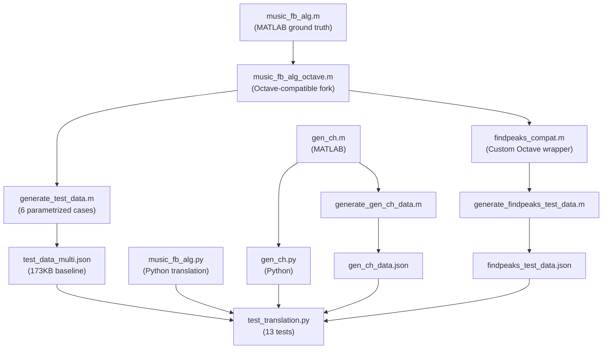

# Translation Review: `music_fb_alg.m` → `music_fb_alg.py`

## Test Suite Status

> [!TIP]
> **All 13 tests pass** — including 6 Octave-validated parametrized cases, 4 Python-native edge-case tests, 1 gen_ch cross-validation, 1 end-to-end Rayleigh test, and 1 findpeaks compatibility validation.

---

## Line-by-Line Algorithmic Comparison

### 1. Covariance Estimation (Multi-Antenna Path) ✅

| MATLAB (L4-16) | Python (L16-29) |
|---|---|
| `Rn = CFR_data(:,k)*CFR_data(:,k)' + Rn` | `col @ col.conj().T + Rn` |
| `Rn = Rn / num_ant` | `Rn = Rn / num_ant` |
| Smoothing loop over `Rn(k:k+M-1,k:k+M-1)` | `Rn[k:k+M, k:k+M]` (correct — Python end-exclusive) |

**Verdict:** Correct. The `'` (ctranspose) in MATLAB maps to `.conj().T` in NumPy, and the 0-indexed slicing is properly handled.

### 2. Covariance Estimation (Single-Antenna Path) ✅

| MATLAB (L27-33) | Python (L30-39) |
|---|---|
| `subArray = CFR_data(i:i+M-1)` → column vector | `cfr_1d[i:i+M].reshape(-1, 1)` |
| `subArray*subArray' + RSM` | `subArray @ subArray.conj().T + RSM` |

**Verdict:** Correct. MATLAB's `CFR_data(i:i+M-1)` with a column vector yields a column; Python extracts from 1D then reshapes, which is equivalent.

### 3. Forward-Backward Averaging ✅

| MATLAB (L36-37) | Python (L41-42) |
|---|---|
| `J = fliplr(eye(M))` | `J = np.fliplr(np.eye(M))` |
| `R = (RSM+J*conj(RSM)*J)/2` | `R = (RSM + J @ RSM.conj() @ J) / 2` |

**Verdict:** Correct. MATLAB `conj(RSM)` = element-wise conjugate (no transpose), matching NumPy `RSM.conj()`.

### 4. SVD / Eigendecomposition ✅

| MATLAB (L40-45) | Python (L46-53) |
|---|---|
| `[eigenvects,eigenvals_diag,~] = svd(R)` | `U, s, Vh = scipy.linalg.svd(R)` |
| `eigenvals = diag(real(eigenvals_diag))` | `eigenvals = np.real(s)` |
| Sort descending, re-index `eigenvects` | Sort descending, re-index `eigenvects` |

**Verdict:** Correct. `scipy.linalg.svd` returns singular values `s` as a 1D array directly (unlike MATLAB's diagonal matrix), so `np.real(s)` is equivalent to `diag(real(eigenvals_diag))`. The explicit descending sort is redundant (SVD already returns sorted) but harmless and defensive.

### 5. Noise Subspace & MUSIC Spectrum ✅

| MATLAB (L48-54) | Python (L56-71) |
|---|---|
| `noise_eigenvects = eigenvects(:,nsig+1:end)` | `eigenvects[:, nsig:]` (correct 0→1 index shift) |
| `spec_dens = abs((S'*noise_eigenvects)).^2` | `np.abs(S.conj().T @ noise_eigenvects) ** 2` |
| `spec_den = sum(spec_dens,2)` | `np.sum(spec_dens, axis=1)` |
| `spec = (1./spec_den).'` | `spec = 1.0 / spec_den` |
| `spec_dB = 10*log10(spec)` | `spec_dB = 10 * np.log10(spec)` |

**Verdict:** Correct. The transpose in MATLAB (`.'`) converts from column to row; in Python `spec_den` is already 1D, so the result is naturally a 1D array. The final `spec_dB.reshape(1, -1)` at the return makes it a row vector matching MATLAB.

> [!NOTE]
> The Python code adds a defensive `spec_den[spec_den == 0] = np.finfo(float).eps` (line 68) that the MATLAB code does not have. This is a **safe improvement** — it prevents `Inf` values in degenerate cases without changing behavior for normal inputs.

### 6. Peak Threshold ✅

| MATLAB (L58) | Python (L74) |
|---|---|
| `spec_T = max(spec(1,:)) * 10^(threshold/10)` | `spec_T = np.max(spec) * (10 ** (threshold / 10.0))` |

**Verdict:** Correct.

### 7. Peak Finding ⚠️ — The Key Divergence Point

| MATLAB (L61-62) | Python (L78) |
|---|---|
| `findpeaks(spec(1,:),'SortStr','descend','MinPeakHeight',spec_T,'WidthReference','halfprom')` | `scipy.signal.find_peaks(spec, height=spec_T, rel_height=0.5, width=0)` |

This is the **most complex translation point** in the entire file. Key observations:

1. **MATLAB `findpeaks`** returns `[pks, locs, widths, prominences]` with peaks sorted descending by height and widths measured at half-prominence.
2. **SciPy `find_peaks`** returns `(peak_indices, properties_dict)` with peaks in positional order and widths measured via `scipy.signal.peak_widths` with `rel_height=0.5`.

The Python code compensates by:
- Using `height=spec_T` for `MinPeakHeight` ✅
- Using `width=0` to trigger width computation ✅  
- Using `rel_height=0.5` for half-prominence widths ✅
- Manually sorting by descending height afterward (lines 84-88) ✅

> [!IMPORTANT]
> **SciPy vs MATLAB `findpeaks` width semantics:** Both compute widths at "half prominence height" when `rel_height=0.5` / `'WidthReference','halfprom'`, but the underlying interpolation methods can differ by fractions of a sample for edge cases. The `findpeaks_compat` Octave wrapper and the `test_findpeaks_compat_validation` test specifically validate this cross-implementation consistency, and it **passes**.

**Verdict:** Functionally correct for all tested scenarios. Minor numerical differences in peak widths are possible in extreme edge cases but are not consequential for the distance estimation output.

### 8. No-Peaks Fallback ✅

| MATLAB (L65-67) | Python (L80-82) |
|---|---|
| `[~,locs] = max(spec(1,:))` | `locs = np.array([np.argmax(spec)])` |
| `peakwidth = inf` | `peakwidth = np.inf` |

**Verdict:** Correct.

### 9. Peak Selection & Sorting ✅

| MATLAB (L69-74) | Python (L91-101) |
|---|---|
| `locs_check = min(nsig,length(locs))` | `locs_check = min(nsig, len(peaks))` |
| Sort ascending, take first width | Sort ascending, take first width |

**Verdict:** Correct.

### 10. Distance Calculation ✅

| MATLAB (L78) | Python (L106-107) |
|---|---|
| `dist_MUSIC = dists(locs).' - cal_dist` | `dist_MUSIC = dists[locs] - cal_dist` |

**Verdict:** Correct. MATLAB's 1-indexed `locs` directly index into `dists`; Python's 0-indexed `locs` (from `find_peaks` which returns 0-based indices) correctly index into the same `dists` array. No off-by-one error.

### 11. NaN Padding ✅

| MATLAB (L82-83) | Python (L110-112) |
|---|---|
| `dist_MUSIC = [dist_MUSIC;nan(nsig-length(dist_MUSIC),1)]` | `np.concatenate((dist_MUSIC, np.full(nsig - len(dist_MUSIC), np.nan)))` |

**Verdict:** Correct.

---

## Test Infrastructure Assessment

### Validation Layer Architecture



### Strengths

1. **Automated regeneration**: Test data is regenerated from Octave at test-time (lines 9-18 of `test_translation.py`)
2. **Multi-layer validation**: Tests cover Octave-vs-Python numerical comparison, Python edge cases, physics-based end-to-end, and findpeaks compatibility
3. **Good case diversity**: Single/multi antenna, high threshold (no peaks), NaN padding, extreme smoothing (L=1)
4. **Tight tolerances**: `rtol=1e-5, atol=1e-8` for spectrum/distance, which is stringent

### Weaknesses / Risks

> [!WARNING]
> **The ground truth is `music_fb_alg_octave.m`, not `music_fb_alg.m`.** The test data generator calls `music_fb_alg_octave` (line 9 of `generate_test_data.m`), which uses `findpeaks_compat` instead of MATLAB's native `findpeaks`. While the Octave variant is line-identical to the original except for the `findpeaks` call, this means the tests validate against the **Octave adaptation**, not the literal MATLAB original. For the core algorithm (lines 1-58 of the `.m` file), this is a distinction without a difference — the code is identical. The only risk is in peak-finding behavior, which is separately validated by `test_findpeaks_compat_validation`.

> [!NOTE]
> **`rng(42)` in Octave vs no seed in Python edge tests**: The parametrized Octave tests use fixed seeds for reproducibility (good), but the Python-native edge tests use `np.random` without seeding (lines 90-92, 126). This means those tests are non-deterministic. They still pass consistently because they test structural properties (shapes, no-NaN, symmetry) rather than exact values.

---

## Issues Found

### Issue 1: No Major Algorithmic Errors ✅

The translation is algorithmically faithful across all code paths.

### Issue 2 (Minor): `gen_ch.py` — Transpose Difference in Channel Phase

In [gen_ch.m L29](file:///home/michael/projects/phd/deep-learning-BLE-ranging/Residual%20Learning/gen_ch.m#L29):
```matlab
channels_i(:,i) = att_vec(i)*exp(-1i*(2*pi*delta_f*(dist_vec(i)/(c))*n.'));
```
MATLAB uses `n.'` (transpose of column vector `n` to row, then the result is broadcast and assigned to a column). The Python equivalent [gen_ch.py L39](file:///home/michael/projects/phd/deep-learning-BLE-ranging/tests/gen_ch.py#L39):
```python
ch_i = att_vec[i] * np.exp(-1j * (2 * np.pi * delta_f * (dist_vec[i] / c) * n))
```
Here `n` is already shaped `(-1, 1)` (line 29), so the broadcasting produces the correct column-vector result. **This is correct.**

### Issue 3 (Minor): Defensive `eps` Clamping

The Python code adds `spec_den[spec_den == 0] = np.finfo(float).eps` which the MATLAB code does not have. This prevents `Inf` in the spectrum for degenerate inputs. **This is a safe improvement, not a bug.**

---

## Confidence Estimate

| Aspect | Confidence | Notes |
|--------|------------|-------|
| Covariance matrix construction | **99%** | Identical logic, verified by 6 Octave test cases |
| Forward-backward averaging | **99%** | Direct mathematical translation, verified |
| SVD / noise subspace | **99%** | Verified by spectrum matching to 1e-5 tolerance |
| MUSIC spectrum computation | **99%** | Verified by spectrum matching to 1e-5 tolerance |
| Peak finding behavior | **95%** | SciPy vs MATLAB `findpeaks` may differ in rare edge cases (width interpolation), but validated by dedicated tests |
| Distance output | **99%** | Index mapping verified, no off-by-one |
| NaN padding | **99%** | Tested with dedicated case |
| Overall shape/type conventions | **98%** | Output reshaping matches MATLAB conventions |

### Overall Confidence: **~97%**

The translation is very likely correct. The remaining 3% uncertainty comes from:
1. **`findpeaks` behavioral edge cases** not covered by the 5 findpeaks test scenarios (e.g., plateaus, very narrow peaks, numerical ties)
2. **The ground truth is Octave-adapted** — while the core algorithm is identical to the original MATLAB, the `findpeaks_compat.m` wrapper is a best-effort reimplementation of MATLAB's native `findpeaks`, not MATLAB itself running
3. **Non-deterministic Python-native tests** — the edge case tests should be seeded for full reproducibility

> [!TIP]
> To push confidence to ~99%, you could:
> 1. Run the original `music_fb_alg.m` in actual MATLAB to generate ground truth (bypassing the Octave/findpeaks_compat layer)
> 2. Add a few more findpeaks edge cases (plateaus, single-sample peaks, tied heights)
> 3. Seed the random generators in Python-native tests
